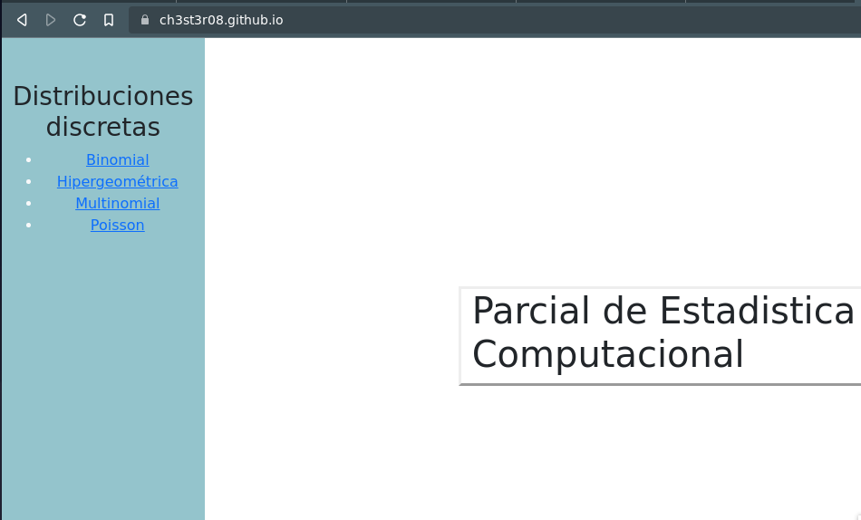
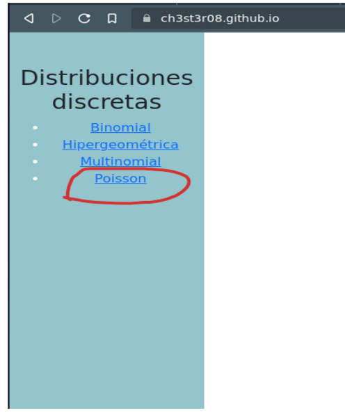
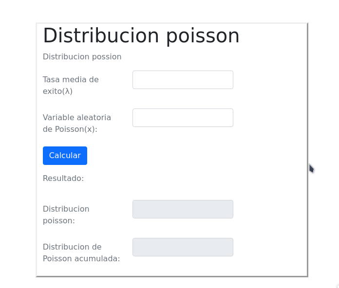
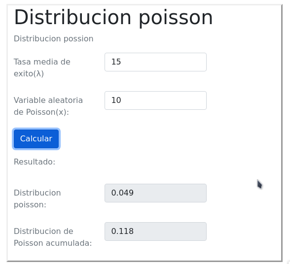

# Calculadora de Funciones para probabilidad discreta

## Manual de Instrucciones

Al iniciar la aplicación se podrá visualizar el contenido principal, el cual mostrará una serie de opciones a la izquierda
las cuales corresponden a las diferentes distribuciones realizadas

Luego se podrá seleccionar una opción, en este caso la **Distribución de Poisson**

Como se puede apreciar se muestra el formulario de la distribución en donde se podrá
completar los datos requeridos

Vamos a proceder a llenar el campo de Lambda con el valor de **15** y X en **10**
y se podrá observar que la calculadora de Poisson nos da un resultado de **0.04861**
en la calculadora aproximado

La dinámica es similar para los siguientes enlances restantes

### Muchas gracias

